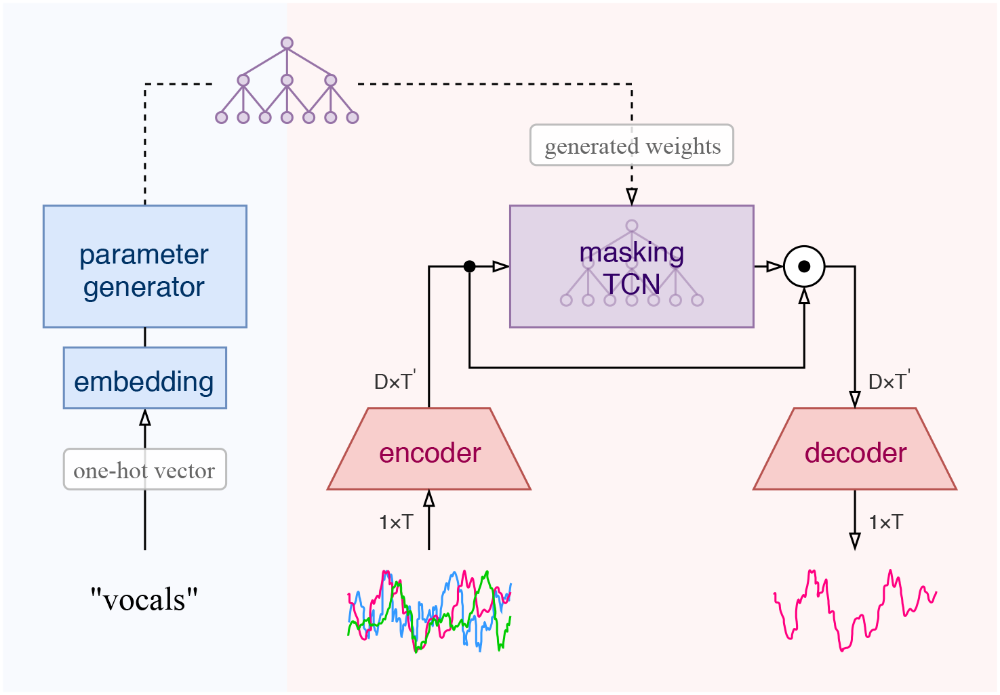
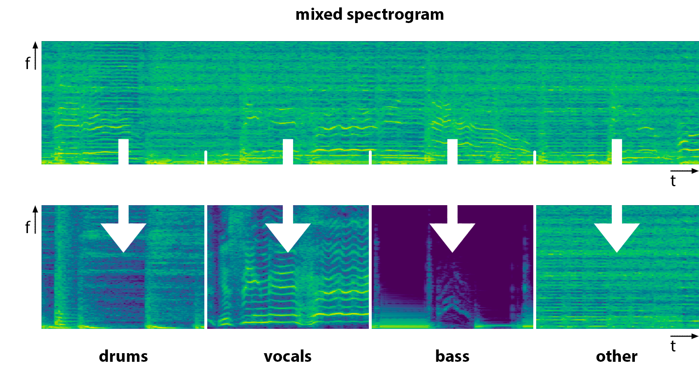
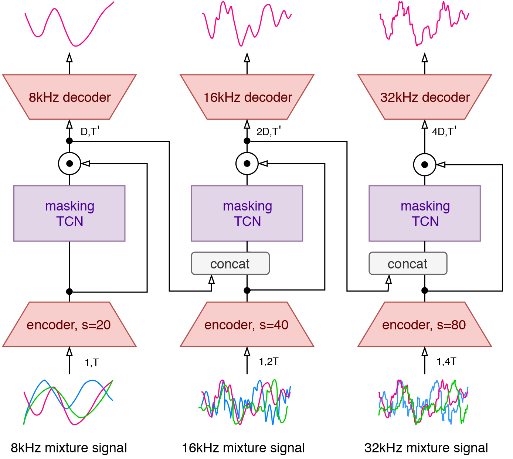

<p align="center">
    
</p>

<h1 align="center">
  META-LEARNING FOR MUSIC SOURCE SEPARATION
</h2>

<p align="center">
  <em>David Samuel,<sup>*</sup> Aditya Ganeshan & Jason Naradowsky</em>
  <br>
  <sub><sup>*</sup>part of this work has been done during internship at PFN</sub>
<p>  
  
<p align="center">
  <a href="https://colab.research.google.com/drive/1iVFGlRuhdpjtnO3a7ATzgd-lnPxtd4oT"><strong>Interactive demo</strong></a> | <a href="https://arxiv.org/abs/2002.07016"><strong>Paper</strong></a>
<p>
  

  
<br>

We propose a hierarchical meta-learning-inspired model for music source separation in which **a generator model is used to predict the weights of individual extractor models**.  This enables efficient parameter-sharing, while still allowing for instrument-specific parameterization.  The resulting models are shown to be more effective than those trained independently or in a multi-task setting, and achieve performance comparable with state-of-the-art methods.

<br>

## Brief Introduction to Music Source Separation

Given a mixed source signal, the task of source separation algorithm is to divide the signal into its original components. We test our method on music separation and specifically on the [MUSDB18 dataset](https://zenodo.org/record/1117372#.XiSY9Bco9QJ) where the sources consist of contemporary songs and the goal is to divide them into four stems: 

   &nbsp;&nbsp;&nbsp;&nbsp;&nbsp;&nbsp;:drum::shark:&nbsp;&nbsp; **drums**  
   &nbsp;&nbsp;&nbsp;&nbsp;&nbsp;&nbsp;:studio_microphone::rabbit2:&nbsp;&nbsp; **vocals**  
   &nbsp;&nbsp;&nbsp;&nbsp;&nbsp;&nbsp;:guitar::eagle:&nbsp;&nbsp; **bass**  
   &nbsp;&nbsp;&nbsp;&nbsp;&nbsp;&nbsp;:saxophone::snake:&nbsp;&nbsp; **other accompaniments**
 
 
Music source separation can not only be used as a preprocessing step to other MIR problems (like sound source identification), but it can also be used more creatively: we can create backing tracks to any song for musical practice or just for fun (karaoke), we can create "smart" equilizers that are able to make a new remix, or we can separate a single instrument to better study its intricacies (guitar players can more easily determine the exact chords for example). 

<br>

<p align="center">
    
</p>

<p align="center">
  <sub><em>Illustration of a separated audio signal (projected on log-scaled spectrograms). The top spectrogram shows the mixed audio that is transformed into the four separated components at the bottom. Note that we use the spectrograms just to illustrate the task — our model operates directly on the audio waveforms.</em></sub>
</p>

<br>

## Generating Extractor Models

The key idea is to utilize a tiered architecture where a **generator** network "supervises" the training of the individual extractors by **generating some of their parameters directly**.  This allows the generator to develop a dense representation of how instruments relate to each other *as it pertains to the task*, and to utilize their commonalities when generating each extractor.

Our model is based on [Conv-TasNet](https://arxiv.org/abs/1809.07454), a time domain-based approach to speech separation comprising three parts: 
1. an **encoder** which applies a 1-D convolutional transform to a segment of the mixture waveform to produce a high-dimensional representation
2. a **masking function** which calculates a multiplicative function which identifies a targeted area in the learned representation 
3. a **decoder** (1-D inverse convolutional layer) which reconstructs the separated waveform for the target source.

The masking network is of particular interest, as it contains the source-specific masking information; the encoder and decoder are source-agnostic and remain fixed for separation of all sources.

<br>

## Multi-stage Architecture

Despite the data's higher sampling rate (44kHz), we find that models trained using lower sampling rates are more effective despite the loss in resolution.  We therefore propose a multi-stage architecture to leverage this strength while still fundamentally predicting high resolution audio and use three stages with 8, 16 and 32kHz sampling rates.

<br>
<p align="center">
    
</p>
<p align="center">
  <sub><em>Illustration of the multi-stage architecture. The resolution of the estimated signal is progressively enhanced by utilizing information from previous stages. The encoders increase the stride <strong>s</strong> to preserve the same time dimension <strong>T'</strong>. Note that the masking TCN is still generated (not included in the illustration).</em></sub>
</p>

<br>

## Results

- signal-to-distortion ratio (SDR) evaluated with BSSEval v4
- results are in dB, higher is better (median of frames, median of tracks)
- methods annotated with “*” use the audio directly, without a spectrogram sidestep  

<p align="center">
  
</p>

<br>

## How to Run

1) First, you have to download the [MUSDB18 dataset](https://zenodo.org/record/1117372#.XiB9Cxco9QI) and run the data generator to resample to music stems and save them as numpy arrays: `python3 data_generator.py --musdb_path path/to/the/downloaded/dataset`.

2) After creating the dataset, you can start the training by running `python3 train.py`. Please note that this configuration was trained on 2 Nvidia V100 GPUs so you need ~64 GB of GPU memory to train with the default batch size.

3) Finally, you can evaluate the model by running `python3 evaluate.py --model_dir directory --musdb_path path/to/the/downloaded/dataset`.

<br>

## Interactive Demo

You can try an interactive demo of the pretrained model in [**Google Colab notebook**](https://colab.research.google.com/drive/1iVFGlRuhdpjtnO3a7ATzgd-lnPxtd4oT).

<br>

## Pretrained Model

A pretrained model on the MUSDB18 dataset can be downloaded from [here](https://www.dropbox.com/s/zw6zgt3edd88v87/best_model.pt). After downloading, load the model by the following Python lines. An example usage of the pretrained model for separation can be seen in the aforementioned [Google Colab notebook](https://colab.research.google.com/drive/1iVFGlRuhdpjtnO3a7ATzgd-lnPxtd4oT).

```python
state = torch.load("best_model.pt")  # load checkpoint
network = MultiTasNet(state["args"]).to(device)  # initialize the model
network.load_state_dict(state['state_dict'])  # load the pretrained weights
```
<br>

## Cite

```
@inproceedings={meta-tasnet:2020,
    title={Meta-learning Extractors for Music Source Separation},
    author={David Samuel and Aditya Ganeshan and Jason Naradowsky},
    booktitle={IEEE International Conference on Acoustics, Speech and Signal Processing (ICASSP)},
    pages={816-820},
    year={2020},
}
```
<br>

## License

[MIT License](LICENSE)
